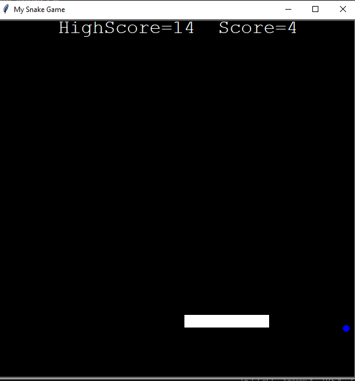

# Snake game

This is my first project created after completing my Engineering 1st year.I built this project using python basics
and Object-Oriented Programming basic concepts.
## Screenshot

## Features

- Snake movement using keyboard keys
- Food collision detection
- Score tracking
- High Score 
- Game over when snake hits wall or its body part

## Technologies used

- Python
- Turtle Graphics
- Object-Oriented Programming

## Project Files

- snake_main.py
- snake_body.py
- food.py
- scoreboard.py

## How to run

- Download this repository
- Run: **python snake_main.py**
